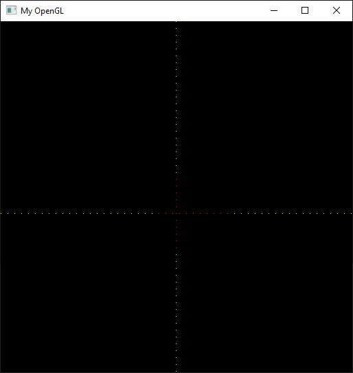
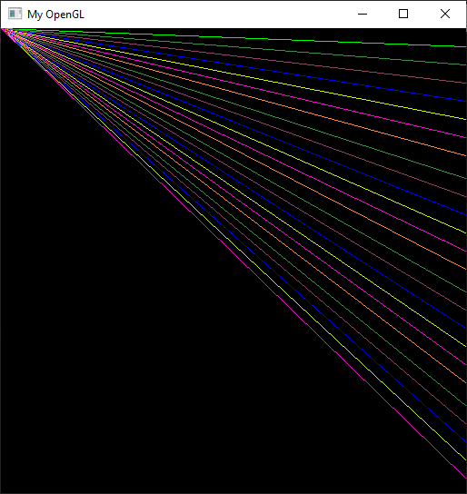
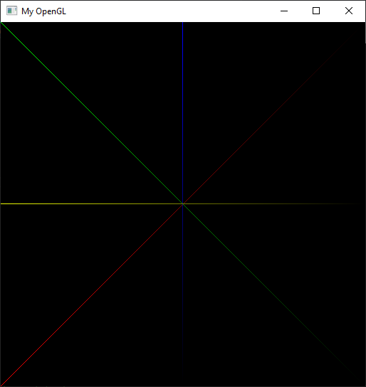

# T1
Algoritmos de rasterização


## Sumário

<!--
* [Introdução](#introdução)
* [Rasterização de pontos](#rasterização-de-pontos)
* [Rasterização de retas](#rasterização-de-retas)
* [Desenho de triângulos](#desenho-de-triângulos)
* [Referências](#referências)
-->

---

## Introdução

O projeto implementa algoritmos para a renderização de pontos e linhas na tela.

## Rasterização de pontos

Rasterização é o processo de converter um modelo matemático em um conjunto de pixels que aproxima-se do desenho desejado.
Para realizar esta operação, deve-se exibir os pixels do display com cores específicas para formar imagens.
Os pixels são representados em uma malha - **Figura 1** - ```X x Y``` onde ```X``` é a largura da tela e ```Y``` é a altura da mesma.
Por exemplo, em uma tela Full HD existem ```1920x1080 pixels``` (1920 colunas e 1080 linhas).

<p align="center">
  <br>
  
  <h5 align="center">Figura 1 - Tela formada por pixels (Fonte: slide da aula 'Rasterization')</h5>
</p>

Para identificar o local correto de desenhar o pixel, deve-se calcular o offset do mesmo com base na dimensão da janela.
A posição retornada pelo offset será o primeiro byte onde o pixel está definido.
O método que encontra tal posição pode ser visto a seguir:

``` C++
void PutPixel(pixel p)
{
  int posicao = (p.x * 4) + (p.y * IMAGE_WIDTH * 4);
  ...
}
```

Da função PutPixel pode-se verificar o seguinte:

1. x é a posição onde o pixel estará em relação a largura da tela;
2. y é a posição onde o pixel estará em relação a altura da tela;
3. IMAGE_WIDTH é a largura da tela.

O 4 define o tamanho de um pixel. Cada pixel da aplicação segue o formato RGBA, ou seja, a mesma utiliza quatro canais para representar a cor.

1. R - Canal Vermelho - Red;
2. G - Canal Verde - Green;
3. B - Canal Azul - Blue;
4. A - Canal Alpha - Transparência

Cada canal possui um byte - 256 combinações por canal -  responsável por armazenar a sua informação. Logo, podemos compreender que ```1R + 1B + 1G + 1A = 4 bytes```.

Sabendo destas informações foi implementada a primeira técnica de rasterização, desenhar um pixel na tela. A rasterização do ponto é implementada na função PutPixel, descrita abaixo:

``` C++
void PutPixel(pixel p)
{
  int posicao = (p.x * 4) + (p.y * IMAGE_WIDTH * 4);

  FBptr[posicao + 0] = p.RGBA[0];
  FBptr[posicao + 1] = p.RGBA[1];
  FBptr[posicao + 2] = p.RGBA[2];
  FBptr[posicao + 3] = p.RGBA[3];
}
```

<p align="center">
  <br>
  
  <h5 align="center">Figura 2 - Validação da função PutPixel</h5>
</p>

## Rasterização de retas

A rasterização de retas consiste em gerar pixels da forma mais ordenada possível com o intuito de gerar uma reta.
Para alcançar tal objetivo foi utilizado o algoritmo de Bresenham que pode ser visto abaixo.

```C++
void drawline(pixel p0, pixel p1) {
  int dx = p1.x - p0.x;
  int dy = p1.y - p0.y;

  int inclinacao;
  float distanciaParcial;
  float distanciaTotal = distancia(p0, p1);

  if (dx < 0)
  {
    drawline(p1, p0);
    return;
  }

  inclinacao = dy < 0  ? -1 : 1;

  int incr_e_dy, incr_e_dx, incr_ne_positivo, incr_ne_negativo, d;
  incr_e_dy = 2 * dy;
  incr_e_dx = 2 * dx;
  incr_ne_positivo = 2 * (dy + dx);
  incr_ne_negativo = 2 * (dy - dx);

  pixel aux = p0;

  PutPixel(p0);

  if (dx >= inclinacao*dy)
  {
    if (dy < 0)
    {
      d = incr_e_dy + dx;
      while (aux.x < p1.x)
      {
        if (d < 0)
        {
          d += incr_ne_positivo;
          aux.x++;
          aux.y--;
        }
        else
        {
          d += incr_e_dy;
          aux.x++;
        }

        distanciaParcial = distancia(aux, p1);
        aux = interpolacaoCor((distanciaParcial / distanciaTotal), p0, p1, aux);
        PutPixel(aux);
      }
    }
    else
    {
      d = incr_e_dy - dx;
      while (aux.x < p1.x)
      {
        if (d < 0)
        {
          d += incr_e_dy;
          aux.x++;
        }
        else
        {
          d += incr_ne_negativo;
          aux.x++;
          aux.y++;
        }

        distanciaParcial = distancia(aux, p1);
        aux = interpolacaoCor((distanciaParcial / distanciaTotal), p0, p1, aux);
        PutPixel(aux);
      }
    }
  }
  else
  {
    if (dy < 0)
    {
      d = dy + incr_e_dx;
      while (aux.y > p1.y)
      {
        if (d < 0)
        {
          d += 2 * dx;
          aux.y--;
        }
        else
        {
          d += incr_ne_positivo;
          aux.x++;
          aux.y--;
        }

        distanciaParcial = distancia(aux, p1);
        aux = interpolacaoCor((distanciaParcial / distanciaTotal), p0, p1, aux);
        PutPixel(aux);
      }
    }
    else
    {
      d = dy - incr_e_dx;
      while (aux.y < p1.y)
      {
        if (d < 0)
        {
          d += incr_ne_negativo;
          aux.x++;
          aux.y++;
        }
        else
        {
          d += -incr_e_dx;
          aux.y++;
        }

        distanciaParcial = distancia(aux, p1);
        aux = interpolacaoCor((distanciaParcial / distanciaTotal), p0, p1, aux);
        PutPixel(aux);
      }
    }
  }

  PutPixel(p1);
}
```

Porém, o algoritmo acima só desenha linhas para o primeiro octante, ou seja, retas que se encontram entre 0º e 45º.
Para melhor exemplificar uma captura de tela do algoritmo acima sendo executado pode ser vista abaixo.

<p align="center">
  <br>
  
  <h5 align="center">Figura 3 - DrawLine para o primeiro octante</h5>
  <br>
</p>

Para generalizar o algoritmo deve-se:

* Calcular a variação do ponto de origem para o ponto de destino da reta;
* Examinar tal variação para que se possa indicar se devemos incrementar ou decrementar coordenadas para desenhar a reta;
* Verificar a variação para que, se necessário, haja a troca dos componentes x, y;
* Verificar as coordenadas para trocar os planos.

Para verificar as expressões condicionais é interessante seguir a seguinte tabela que exemplifica a posição da reta.

<p align="center">
  <br>
  
  <h5 align="center">Figura 4 - Representação de Bresenham nos octantes</h5>
  <br>
</p>

Como resultado temos:

<p align="center">
  <br>
  
  <h5 align="center">Figura 5 - Bresenham generalizado</h5>
  <br>
</p>


## Desenho de triângulos

O algoritmo abaixo desenha um triângulo usando o drawline.

```C++
void drawTriangle(pixel p0, pixel p1, pixel p2)
{
  if (p0.x < p1.x && p0.x < p2.x)
  {
    drawline(p0, p1);
    drawline(p0, p2);

    if (p1.x < p2.x)
      drawline(p1, p2);
    else
      drawline(p2, p1);
  }
  else
  {
    if (p1.x < p0.x && p1.x < p2.x)
    {
      drawline(p1, p0);
      drawline(p1, p2);

      if (p0.x < p2.x)
        drawline(p0, p2);
      else
        drawline(p2, p0);
    }
    else
    {
      if (p2.x < p0.x && p2.x < p1.x)
      {
        drawline(p2, p0);
        drawline(p2, p1);

        if (p0.x < p1.x)
          drawline(p0, p1);
        else
          drawline(p1, p0);
      }
    }
  }
}
```
