# T1
Algoritmo de rasterização: [Bresenham](https://en.wikipedia.org/wiki/Bresenham's_line_algorithm).


## Sumário

* [Notas](#notas)
* [Introdução](#introdução)
* [Rasterização de pontos](#rasterização-de-pontos)
* [Rasterização de retas](#rasterização-de-retas)
* [Desenho de triângulos](#desenho-de-triângulos)
* [Resultados](#resultados)
* [Referências](#referências)

---

## Notas

* Pré-requisitos: Visual Studio 2015 Update 2.

1. Para compilar o projeto, é preciso escolher um o método de compilação entre `Release` ou `Debug`, e também o tipo de Sistema Operacional entre `x64` ou `x86`.
2. Após isso, copie as dll da pasta `CG_Assignment_1\src\binary\glew-2.0.0\bin\x64\` (ou x86, dependendo da sua escolha do passo 1) e cole na pasta `CG_Assignment_1\` (mesma pasta em que este `README` se encontra). O nome da dll deve manter-se `glew32_x64.dll` ou `glew32_x86.dll`.
3. Copie também as dll da pasta `CG_Assignment_1\src\binary\freeglut\bin\x64\` (ou da pasta anterior para x86, dependendo da sua escolha do passo 1) e cole na pasta `CG_Assignment_1\` (mesma pasta em que este `README` se encontra). O nome da dll deve manter-se `freeglut.dll`, independente da escolha do passo 1.

* As dlls do GLEW (para x64 e x86) e a dll do FreeGlut (apenas para x64) já estão na pasta `CG_Assignment_1`.

## Introdução

> O projeto implementa algoritmos para a renderização de pontos e linhas na tela.

## Rasterização de pontos

> Rasterização é o processo de converter um modelo matemático em um conjunto de pixels que aproxima-se do desenho desejado.
Para realizar esta operação, deve-se exibir os pixels do display com cores específicas para formar imagens.
Os pixels são representados em uma malha - **Figura 1** - ```LARGURA_DA_TELA x ALTURA_DA_TELA```.
Por exemplo, em uma tela Full HD existem ```1920x1080 pixels``` (1920 colunas e 1080 linhas).

<p align="center">
  <br>
  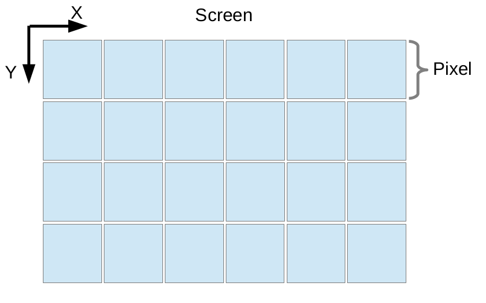
  <h5 align="center">Figura 4 - Representação de Bresenham nos octantes</h5>
</p>

<p align="center"><i>Função para desenhar (exibir) um pixel na tela</i></p>

``` C++
void MyGL::drawPoint(Point point)
{
  if (!point.isValid())
  {
    std::cerr << "Point of coordinates XY(" << point.x << ", " << point.y << ")" << std::endl;
    return;
  }

  uint_fast16_t memoryPosition = point.getMemoryPosition();
  const Color& color = point.getColor();
  for (int i = 0; i < 4; i++)
    frameBuffer[memoryPosition++] = color.getRGBA(i);
}
```

Na função drawPoint, as informações importantes são as seguintes:
1. Função `getMemoryPosition()`;
2. Escrita de dados do `frameBuffer`.

#### Função getMemoryPosition()
> Para identificar o local correto para desenhar o pixel, deve-se calcular o `offset` (deslocamento) do mesmo com base na dimensão da janela. A posição retornada pelo offset será o primeiro byte onde o pixel está definido. A função getMemoryPosition() retorna esta posição de memória em que o pixel está.

<p align="center"><i>Função getMemoryPosition()</i></p>

``` C++
inline uint_fast16_t getMemoryPosition()
{
  return (x + y * SCREEN_WIDTH) * 4;
}
```

Desta função, pode-se afirmar o seguinte

1. `x` é a posição onde o pixel estará em relação à largura da tela;
2. `y` é a posição onde o pixel estará em relação à altura da tela;
3. `SCREEN_WIDTH` é a largura da tela.
4. A `constante 4` no final da equação define o tamanho de um pixel, que segue o formato `RGBA`, ou seja, a mesma utiliza `4 canais` para representar a `cor`.
    * R - Canal Vermelho (Red);
  * G - Canal Verde (Green);
  * B - Canal Azul (Blue);
  * A - Canal Alpha (Transparência).

> Cada canal ocupa 1 byte, ou seja, 256 valores e, com este byte, é responsável por armazenar o valor de sua intensidade (valores entre 0 a 255). Logo, podemos compreender que cada pixel da tela possui uma cor e, portanto, ocupa 4 bytes: `R(1 byte) + G(1 byte) + B(1 byte) + A(1 byte) = 4 bytes`.

#### Escrita de dados do `frameBuffer`
Sabendo-se destas informações, foi implementada a primeira técnica de rasterização: desenhar (exibir) um pixel na tela - `MyGL::drawPoint(Point point)` já mostrada acima. Desta função, podemos destacar a escrita do frameBuffer.

``` C++
...
  for (int i = 0; i < 4; i++)
    frameBuffer[memoryPosition++] = color.getRGBA(i);
...
```

Para exemplo, a tabela abaixo demonstra todos os `valores de dados para uma tela de tamanho 2x2 pixels`:

<br>
<table style="width:100%">
  <tr>
    <th><p align="center"><b>Pixel</b></p></th>
    <th><p align="center"><b>Canal</b></p></th>
    <th><p align="center"><b>Posição de Pixel na Tela</b></p></th>
    <th><p align="center"><b>Offset (deslocamento) =<br>(x + y * SCREEN_WIDTH) * 4</b></p></th>
    <th><p align="center"><b>Posição de Memória no frameBuffer</b></p></th>
    <th><p align="center"><b>Valor do byte (intensidade do canal)</b></p></th>
  </tr>
  <tr>
    <td rowspan="4"><p align="center"><b>0</b></p></td>
    <td><p align="center"><i>Red</i></p></td>
    <td rowspan="4"><p align="center">(<i>x</i>=<u>0</u>, <i>y</i>=<u>0</u>)</p></td>
    <td rowspan="4"><p align="center">(<u>0</u> + <u>0</u> * 2) * 4 = <b>0</b></p></td>
    <td><p align="center">(<i>Offset</i> = 0) + (for i = 0) = <b>0</b></p></td>
    <td rowspan="16"><p align="center"><i>0 a 255</i></p></td>
  </tr>
  <tr>
    <td><p align="center"><i>Green</i></p></td>
    <td><p align="center">(<i>Offset</i> = 0) + (for i = 1) = <b>1</b></p></td>
  </tr>
  <tr>
    <td><p align="center"><i>Blue</i></p></td>
    <td><p align="center">(<i>Offset</i> = 0) + (for i = 2) = <b>2</b></p></td>
  </tr>
  <tr>
    <td><p align="center"><i>Alpha</i></p></td>
    <td><p align="center">(<i>Offset</i> = 0) + (for i = 3) = <b>3</b></p></td>
  </tr>
  <tr>
    <td rowspan="4"><p align="center"><b>1</b></p></td>
    <td><p align="center"><i>Red</i></p></td>
    <td rowspan="4"><p align="center">(<i>x</i>=<u>1</u>, <i>y</i>=<u>0</u>)</p></td>
    <td rowspan="4"><p align="center">(<u>1</u> + <u>0</u> * 2) * 4 = <b>4</b></p></td>
    <td><p align="center">(<i>Offset</i> = 4) + (for i = 0) = <b>4</b></p></td>
  </tr>
  <tr>
    <td><p align="center"><i>Green</i></p></td>
    <td><p align="center">(<i>Offset</i> = 4) + (for i = 1) = <b>5</b></p></td>
  </tr>
  <tr>
    <td><p align="center"><i>Blue</i></p></td>
    <td><p align="center">(<i>Offset</i> = 4) + (for i = 2) = <b>6</b></p></td>
  </tr>
  <tr>
    <td><p align="center"><i>Alpha</i></p></td>
    <td><p align="center">(<i>Offset</i> = 4) + (for i = 3) = <b>7</b></p></td>
  </tr>
  <tr>
    <td rowspan="4"><p align="center"><b>2</b></p></td>
    <td><p align="center"><i>Red</i></p></td>
    <td rowspan="4"><p align="center">(<i>x</i>=<u>0</u>, <i>y</i>=<u>1</u>)</p></td>
    <td rowspan="4"><p align="center">(<u>0</u> + <u>1</u> * 2) * 4 = <b>8</b></p></td>
    <td><p align="center">(<i>Offset</i> = 8) + (for i = 0) = <b>8</b></p></td>
  </tr>
  <tr>
    <td><p align="center"><i>Green</i></p></td>
    <td><p align="center">(<i>Offset</i> = 8) + (for i = 1) = <b>9</b></p></td>
  </tr>
  <tr>
    <td><p align="center"><i>Blue</i></p></td>
    <td><p align="center">(<i>Offset</i> = 8) + (for i = 2) = <b>10</b></p></td>
  </tr>
  <tr>
    <td><p align="center"><i>Alpha</i></p></td>
    <td><p align="center">(<i>Offset</i> = 8) + (for i = 3) = <b>11</b></p></td>
  </tr>
  <tr>
    <td rowspan="4"><p align="center"><b>3</b></p></td>
    <td><p align="center"><i>Red</i></p></td>
    <td rowspan="4"><p align="center">(<i>x</i>=<u>1</u>, <i>y</i>=<u>1</u>)</p></td>
    <td rowspan="4"><p align="center">(<u>1</u> + <u>1</u> * 2) * 4 = <b>12</b></p></td>
    <td><p align="center">(<i>Offset</i> = 12) + (for i = 0) = <b>12</b></p></td>
  </tr>
  <tr>
    <td><p align="center"><i>Green</i></p></td>
    <td><p align="center">(<i>Offset</i> = 12) + (for i = 1) = <b>13</b></p></td>
  </tr>
  <tr>
    <td><p align="center"><i>Blue</i></p></td>
    <td><p align="center">(<i>Offset</i> = 12) + (for i = 2) = <b>14</b></p></td>
  </tr>
  <tr>
    <td><p align="center"><i>Alpha</i></p></td>
    <td><p align="center">(<i>Offset</i> = 12) + (for i = 3) = <b>15</b></p></td>
  </tr>
</table>
<br>

## Rasterização de retas

A rasterização de retas consiste em gerar pixels da forma mais ordenada possível com o intuito de gerar uma reta. Para alcançar tal objetivo foi utilizado o algoritmo de Bresenham que pode ser visto abaixo.

```C++
void MyGL::drawLine(Point beginPoint, Point endPoint, bool initialPointColor /*= true*/)
{
  /// Declaration

  // Point
  Point point(beginPoint);

  // Color
  Color& color = point.getColor();
  Color& endColor = endPoint.getColor();

  // Position
  uint_fast16_t beginX = beginPoint.getX();
  uint_fast16_t beginY = beginPoint.getY();
  uint_fast16_t endX = endPoint.getX();
  uint_fast16_t endY = endPoint.getY();

  // Axis distance
  int_fast32_t distanceX = endPoint.getX() - beginPoint.getX();
  int_fast32_t distanceY = endPoint.getY() - beginPoint.getY();

  /// Octante handling

  // Axis direction
  int_fast32_t beginXAxisDirection = distanceX > 0 ? 1 : (distanceX < 0 ? -1 : 0);
  int_fast32_t beginYAxisDirection = distanceY > 0 ? 1 : (distanceY < 0 ? -1 : 0);
  int_fast32_t endXAxisDirection = beginXAxisDirection;
  int_fast32_t endYAxisDirection = 0;

  // Higher and lower axis
  uint_fast16_t higherAxis = std::abs(distanceX);
  uint_fast16_t lowerAxis = std::abs(distanceY);
  // If higher was supposed to be the lower, switch them
  if (higherAxis < lowerAxis) // X Axis < Y Axis
  {
    // Switch the higher to the lower
    std::swap(higherAxis, lowerAxis);

    // Since now the Y Axis is the higher,
    endXAxisDirection = 0;
    endYAxisDirection = distanceY > 0 ? 1 : (distanceY < 0 ? -1 : 0);
  }

  /// Bresenham

  // Y rounding correction
  // This should prevent Y from being rounded to each integer rather than midway
  uint_fast16_t fractionNumerator = (uint_fast16_t) (higherAxis / 2.);

  // Color
  double newColor[4] =
  {
    (double)color.getR(),
    (double)color.getG(),
    (double)color.getB(),
    (double)color.getA(),
  };
  double higherAxisDouble = (double)higherAxis;
  double colorDirection[4] =
  {
    ((int16_t)endColor.getR() - color.getR()) / higherAxisDouble,
    ((int16_t)endColor.getG() - color.getG()) / higherAxisDouble,
    ((int16_t)endColor.getB() - color.getB()) / higherAxisDouble,
    ((int16_t)endColor.getA() - color.getA()) / higherAxisDouble,
  };

  for (uint_fast16_t i = 0; i < higherAxis; i++)
  {
    // Position
    point.setXY(beginX, beginY);

    // Gradient color
    if (!initialPointColor)
    {
      newColor[0] += colorDirection[0];
      newColor[1] += colorDirection[1];
      newColor[2] += colorDirection[2];
      newColor[3] += colorDirection[3];

      color.setRGBA((uint8_t)newColor[0], (uint8_t)newColor[1], (uint8_t)newColor[2], (uint8_t)newColor[3]);
    }

    // Draw point
    MyGL::drawPoint(point);

    // Increment numerator based on lowerAxis variation
    fractionNumerator += lowerAxis;

    // If numerator is higher than denominator
    if (fractionNumerator > higherAxis)
    {
      // Remove the denominator variation from numerator
      fractionNumerator -= higherAxis;

      beginX += beginXAxisDirection;
      beginY += beginYAxisDirection;
    }
    else
    {
      beginX += endXAxisDirection;
      beginY += endYAxisDirection;
    }
  }
}
```

O algoritmo de Bresenham originalmente desenha apenas para ângulos entre 0° e 45°, mas o código acima foi modificado para desenhar em qualquer ângulo, incluindo interpolação de cor dependendo da cor inicial, cor final, posição inicial e posição final.

O algoritmo, no geral, deve:

* Calcular a variação do ponto de origem para o ponto de destino da reta;
* Examinar tal variação para que se possa indicar se devemos incrementar ou decrementar coordenadas para desenhar a reta;
* Verificar a variação para que, se necessário, haja a troca dos componentes x, y;
* Verificar as coordenadas para trocar os planos.

Para verificar as expressões condicionais é interessante seguir a seguinte tabela que exemplifica a posição da reta.

<p align="center">
  <br>
  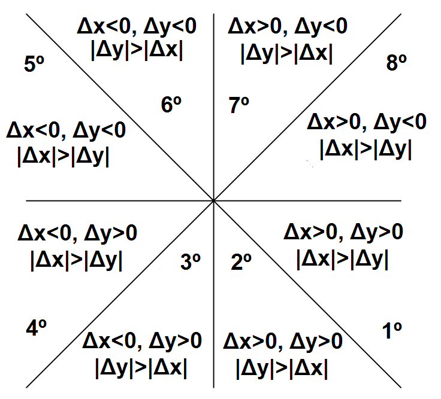
  <h5 align="center">Figura 4 - Representação de Bresenham nos octantes</h5>
</p>

## Desenho de triângulos

O algoritmo abaixo desenha um triângulo utilizando o `MyGL::drawLine(...)`.

```C++
void MyGL::drawTriangle(Point pointA, Point pointB, Point pointC)
{
  MyGL::drawLine(pointA, pointB, false);
  MyGL::drawLine(pointB, pointC, false);
  MyGL::drawLine(pointC, pointA, false);
}
```

## Resultados

<p align="center">
  <br>
  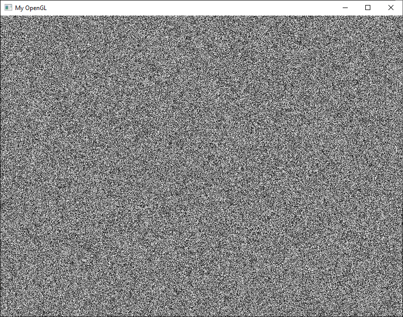
  <br>
  [IMG] Scene 1
  <br>
  <br>
  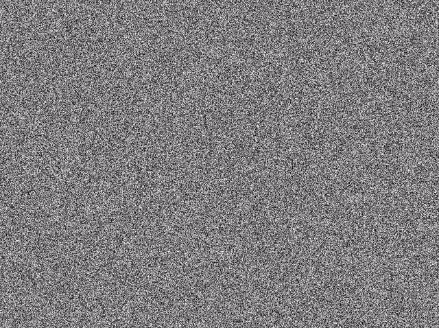
  <br>
  [GIF] Scene 1
  <br>
  <br>
  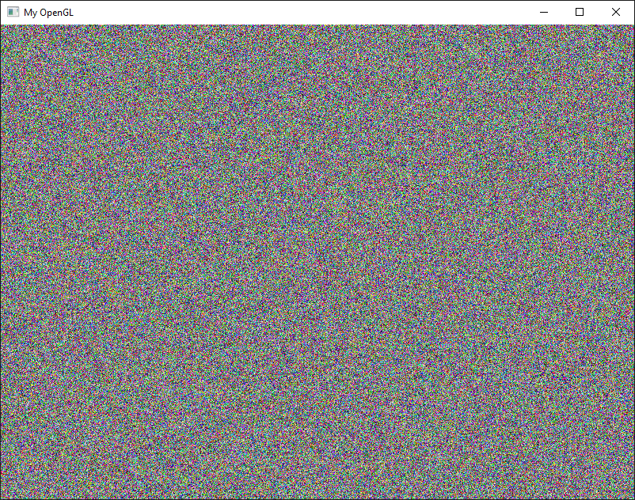
  <br>
  [IMG] Scene 2
  <br>
  <br>
  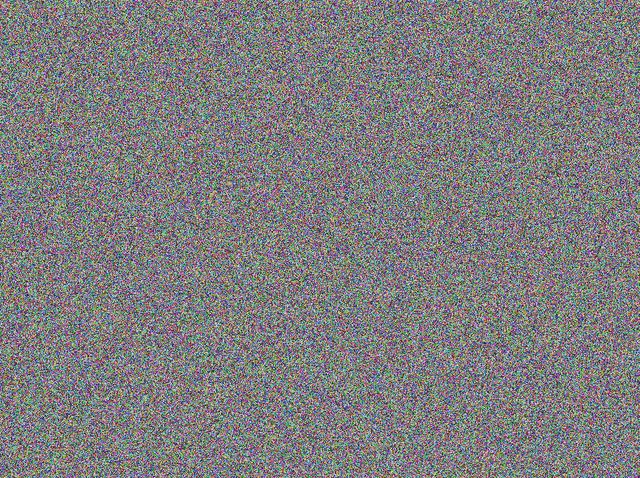
  <br>
  [GIF] Scene 2
  <br>
  <br>
  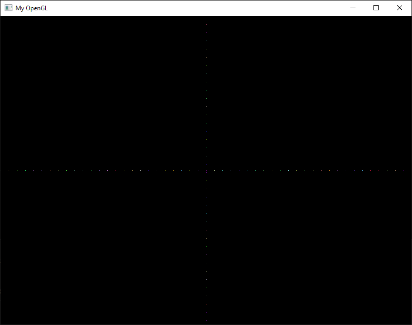
  <br>
  [IMG] Scene 3
  <br>
  <br>
  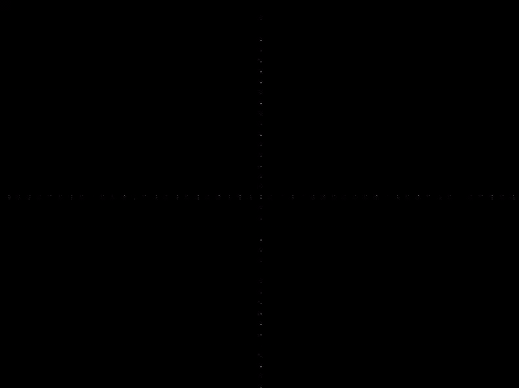
  <br>
  [GIF] Scene 3
  <br>
  <br>
  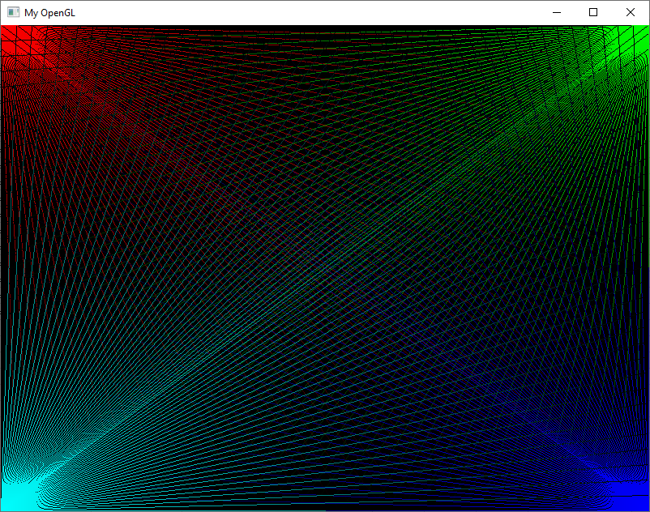
  <br>
  [IMG] Scene 4 (with texture cleaning by function <i>MyGL::clearTexture()</i>)
  <br>
  <br>
  
  <br>
  [GIF] Scene 4 (with texture cleaning by function <i>MyGL::clearTexture()</i>)
  <br>
  <br>
  
  <br>
  [GIF] Scene 4 (no texture cleaning)
  <br>
  <br>
  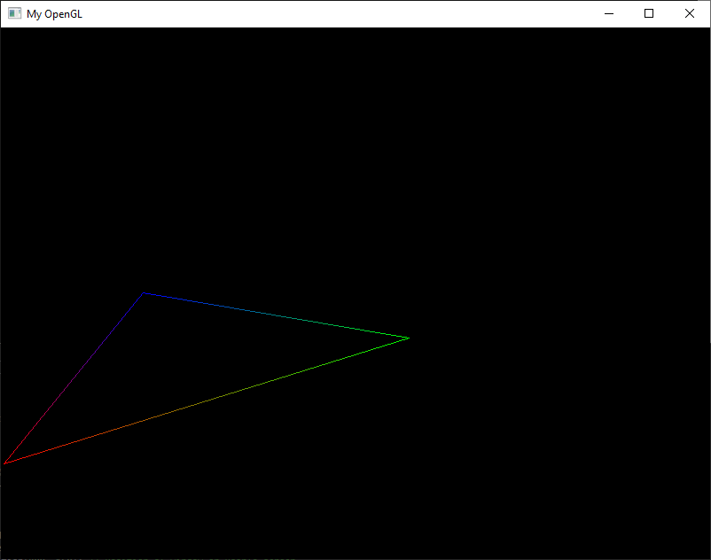
  <br>
  [IMG] Scene 5
  <br>
  <br>
  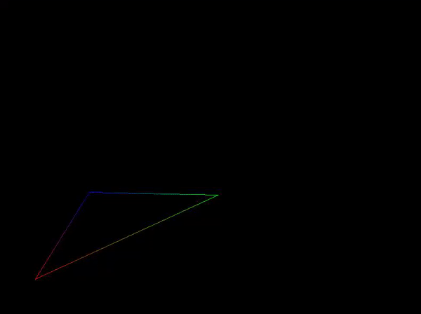
  <br>
  [GIF] Scene 5
  <br>
</p>

## Referências

* [https://www.cs.helsinki.fi/group/goa/mallinnus/lines/bresenh.html](https://www.cs.helsinki.fi/group/goa/mallinnus/lines/bresenh.html)
* [https://en.wikipedia.org/wiki/Bresenham's_line_algorithm](https://en.wikipedia.org/wiki/Bresenham's_line_algorithm)
* [https://www.tutorialspoint.com/computer_graphics/line_generation_algorithm.htm](https://www.tutorialspoint.com/computer_graphics/line_generation_algorithm.htm)
